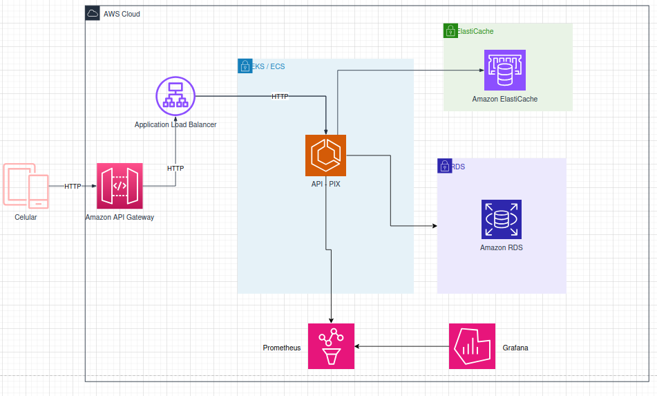
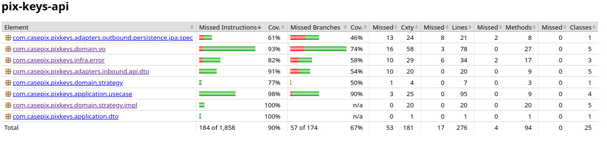

# Módulo de Cadastro de Chaves PIX

API desenvolvida em Java + Spring Boot para gerenciamento de chaves Pix.
Permite criação, alteração e consulta, seguindo regras de negócio, de limites por tipo de pessoa (PF até 5 chaves, PJ
até 20 chaves) e mantendo integridade entre conta e titular.

## Arquitetura

Arquitetura Hexagonal foi escolhida por sua facilidade em desacoplar o domínio de serviços externos, e ainda se torna
independente de frameworks, banco etc.

### Gerenciador de dependências

Gradle

### Dependências

### Spring Boot (starters)

- `spring-boot-starter-data-jpa` — JPA/Hibernate (persistência)
- `spring-boot-starter-validation` — Bean Validation (Jakarta)
- `spring-boot-starter-web` — REST (Spring MVC + Jackson)
- `spring-boot-starter-actuator` — health/metrics/endpoints operacionais

### Banco & Migração

- `org.flywaydb:flyway-core` — migrações de banco
- `org.flywaydb:flyway-database-postgresql` — suporte Flyway p/ Postgres
- `org.postgresql:postgresql` *(runtimeOnly)* — driver JDBC Postgres

### Observabilidade & Docs

- `io.micrometer:micrometer-registry-prometheus` *(runtimeOnly)* — métricas p/ Prometheus
- `org.springdoc:springdoc-openapi-starter-webmvc-ui:2.8.9` — OpenAPI/Swagger UI

### Produtividade

- `org.projectlombok:lombok` *(compileOnly + annotationProcessor)* — reduzir boilerplate

### Testes

- `spring-boot-starter-test` — JUnit 5, Spring Test, etc.
- `org.testcontainers:junit-jupiter` — integração JUnit + Testcontainers
- `org.testcontainers:postgresql` — container de Postgres para testes
- `org.springframework.boot:spring-boot-testcontainers` — auto-config Testcontainers
- `org.testcontainers:testcontainers-bom:1.19.8` — BOM para versões
- `org.mockito:mockito-core` — mocks
- `org.assertj:assertj-core` — fluent assertions
- `org.junit.platform:junit-platform-launcher` *(testRuntimeOnly)* — launcher JUnit

### Cobertura

- **Plugin** `jacoco` — relatórios e verificação de cobertura (regra: BRANCH ≥ 90%)

---

## O que é necessário para rodar?

### Para rodar a aplicação

- **Java 21**
- **Banco PostgreSQL** (pode ser via Docker ou instalado localmente)
- **Gradle** (ou usar o wrapper `./gradlew` que já está no projeto)

### Para rodar os testes

- **Java 21**
- **Docker** (necessário para o Testcontainers rodar o PostgreSQL nos testes)

### Atalhos com Makefile

O projeto possui um **Makefile** que facilita a execução de tarefas comuns:

- `make build` → compila e gera o jar
- `make run` → sobe a aplicação localmente
- `make test` → executa todos os testes
- `make coverage` → gera o relatório de cobertura (Jacoco)
- `make clean` → limpa os artefatos

> Esses comandos utilizam o `gradlew` internamente, então você não precisa instalar o Gradle.

### Endpoints dos Serviços Locais

- **pgAdmin** → [http://localhost:5050](http://localhost:5050)
- **Prometheus** → [http://localhost:9090](http://localhost:9090)
- **Grafana** → [http://localhost:3000](http://localhost:3000)
- **Swagger UI** → [http://localhost:80](http://localhost:80)

## Endpoints da API de Chaves Pix

### Criar chave Pix

**POST** `/chave-pix`

#### Payload de entrada

TIPOS - EMAIL, CELULAR, CNPJ, CPF, ALEATORIA

```json
{
  "tipo": "EMAIL",
  "valor": "teste@pix.com",
  "tipoConta": "CORRENTE",
  "numeroAgencia": "0001",
  "numeroConta": "12345678",
  "nomeCorrentista": "João",
  "sobrenomeCorrentista": "Silva"
}
```

Respostas

✅ 200 — chave criada com sucesso (retorna id UUID)

❌ 422 — erro de validação (ex.: CPF inválido, chave duplicada etc.)

### Alterar chave Pix

**PUT** `/chave-pix/{id}`

#### Payload de entrada

```json
{
  "tipoConta": "POUPANCA",
  "numeroAgencia": "0002",
  "numeroConta": "87654321",
  "nomeCorrentista": "ACME LTDA",
  "sobrenomeCorrentista": ""
}
```

Respostas

✅ 200 — alteração realizada (retorna dados atualizados)

❌ 404 — chave não encontrada

❌ 422 — erro de validação (ex.: conta inválida, chave inativa etc.)

### Consultar chave Pix por ID

**GET** `/chave-pix/{id}`

#### Exemplo de retorno

```json
{
  "id": "455f2b38-420a-4bab-8841-70b80a4c0e0e",
  "tipo": "EMAIL",
  "valor": "teste@pix.com",
  "tipoConta": "CORRENTE",
  "numeroAgencia": "1234",
  "numeroConta": "12345678",
  "nomeCorrentista": "João",
  "sobrenomeCorrentista": "Silva",
  "dataHoraInclusao": "2025-08-19T10:15:30Z",
  "dataHoraInativacao": null
}
```

Respostas

✅ 200 — chave encontrada

❌ 404 — chave não encontrada

### Consultar chave Pix por filtros

**GET**
`/chave-pix?tipo=EMAIL&numeroAgencia=1234&numeroConta=567890&nome=Joao&criadoDe=2025-08-18T00:00:00Z&criadoAte=2025-08-19T23:59:59Z`

#### Exemplo de retorno

```json
[
  {
    "id": "455f2b38-420a-4bab-8841-70b80a4c0e0e",
    "tipo": "EMAIL",
    "valor": "teste@pix.com",
    "tipoConta": "CORRENTE",
    "numeroAgencia": "1234",
    "numeroConta": "12345678",
    "nomeCorrentista": "João",
    "sobrenomeCorrentista": "Silva",
    "dataHoraInclusao": "2025-08-19T10:15:30Z",
    "dataHoraInativacao": null
  }
]
```

Respostas

✅ 200 — lista de chaves encontradas

❌ 404 — nenhum registro encontrado

❌ 422 — combinação inválida de filtros (ex.: informar ID junto com outros filtros; usar inclusão e inativação ao mesmo
tempo; agência e conta devem ser informados juntos)

### TODO — Segunda leva de melhorias

- [ ] Implementar **idempotência no POST /chave-pix**
  - Utilizar um header `Idempotency-Key` ou similar para garantir que múltiplos requests iguais não gerem chaves
    duplicadas.

- [ ] Criar o endpoint **DELETE /chave-pix/{id}**
  - Inativar uma chave existente.
  - Retornar payload com dados da chave e data de inativação.
  - Seguir regras de negócio descritas (não permitir alterações/consultas após inativação).

- [ ] Refatorar testes
  - Renomear métodos de teste para **inglês** (ex: `shouldCreatePixKey_whenValidRequest`).
  - Adicionar anotações **`@DisplayName`** para deixar a saída de testes mais legível.

### Arquitetura para produção



### Cobertura de Testes


